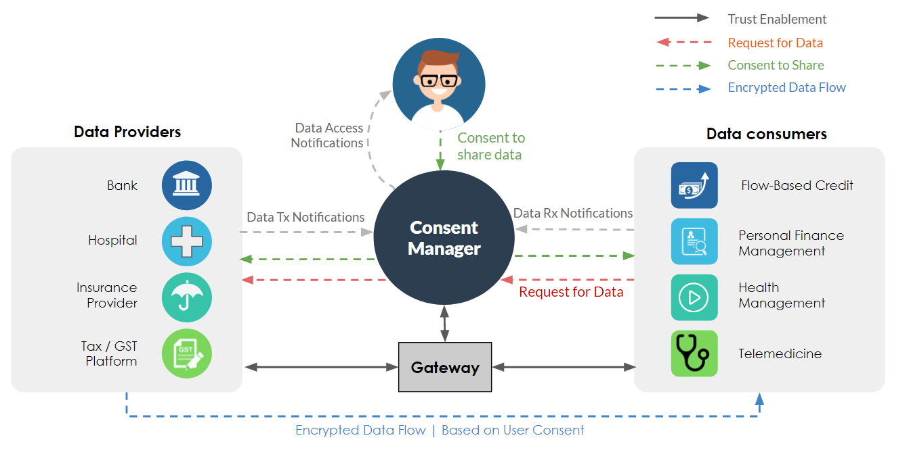

# 2. High Level architecture

## Terminology

**_Data Principal_**
_The person to whom the data belongs._

**_Guardian_**
_The person who is appointed by the Data Principal or by legal means to take actions on Data Principal's behalf._

**_Delegatee_**
_The person appointed by the Data Principal to take actions. A delegatee can delegate this to another delegatee if Data Principal allows._

**_Nominee_**
_The person who takes over the account of the Data Principal post his death._

**_Data Provider_**
_A data provider (DP) is an entity that collects or generates digital data and stores it in a software system. Essentially DPs are custodians of the Data Principal’s data. DPs could be clinical establishments like hospitals, health service providers, insurance companies, banks, tax authorities, schools, Universities, Govt. Agencies, etc. These establishments act as custodians of the Data Principal’s data and they rely on Consent managers for the purpose of collecting consent from the Data Principal for the purpose of data sharing.  A DP could host its own software system or could use a third party service provider to participate in the ecosystem._


**_Data Consumer_**
_A data Consumer(DC) is an entity that seeks digital data from the Data Principal, in order to provide services. The DC places the request for the need of data with the CM which triggers the process of consent collection from the Data Principal. DCs include hospitals, health technology companies, banks, financial technology companies, govt departments, employment exchanges or any entity that is interested in delivering services to the Data Principal based on his data. These entities could have their own systems or use a third party service provider to be part of the network._


**_Consent Manager_**
_A consent manager is an entity that acts as a consent collector for the user and mediates personal data flows from DPs to DCs. Our architecture allows multiple entities to play the role of a CM and each must have its own front-end (a mobile app, a Web app, or a human agent who interfaces with a mobile/Web app) for interacting with users. A CM cannot access data of users, even in encrypted form, unless it is also an DC and accesses information in that capacity. Its role is primarily to enable consent collection, based on which data is shared from DPs to DCs. It also enables discovery of DPs from which user data can be shared. Consent managers are a key mechanism for ensuring **privacy by design** in our architecture._

**_Gateway_**
_A gateway enables DPs, DCs, and CMs to connect with each other and exchange information. Gateways are the key mechanism for creating a network and enabling trust between the entities which join the network. We envision gateways to be sectoral in nature where they play the role of on-boarding, monitoring and auditing different entities in the network in a semi-automated manner; thus, they are also a key vehicle for our design principle of **transparency and accountability**._
        
## Architecture

The DEPA architecture has the following essential actions through which the whole ecosystem comes to life.

* **Network Onboarding** - All the participants of a transaction i:e Consent Manager, Data Provider and Data Consumer must get themselves on-boarded to a gateway. It's post onboarding only that these entities will be able to discover, do resolution of each other and participate in a data transaction. A Gateway will facilitate the on-boarding workflow.

* **Resolution** - Entities will have to resolve each other for having access to the metadata of the entity and the service endpoints where the connection can be established. Gateway will expose resolution functionality for the entities on its network.

* **Linking Accounts** - A user needs to link his DPs with the consent manager. This linking can be initiated via the DP itself or the CM, in the latter case there will be a need to discover the DPs on the CMs interface before the linking can be initiated. The linking will enable exchange of tokens between the DP and the CM and build a trust relation between the two entities. The linking process will also enable the CM to know about the accounts which user has associated with it, this will be required at the time of consent collection.

* **Consent collection and sharing**- The consent is collected by the CM and shared with DP and DC. Sharing of consent will enable the sharing of data as a next step. A precursor to giving consent is the linking of accounts with DP so that users can select the accounts and DPs from where the data needs to be shared with the DC. A User can select multiple DPs and accounts for a single consent.

* **Data fetching**- Post the consent is shared with the DC, DC initiates the fetching of data from DP. The data transfer will be P2P between DP and DC but facilitated by the CM. 

* **DP Discovery** - A DP discovery will only be needed in case the user initiates the linking from the CMs system. Since all the entities are on boarded onto the gateway, gateway will enable the discovery of DP via APIs. CM will use these APIs to assist users in discovering DPs.

The responsibility of the gateway is very minimal. The gateway enables the transacting entities (DPs, CMs and DCs) to discover each other on the network (and their respective communication addresses) and helps establish trusted one-to-one connections between them. _No_ traffic passes through the gateway. Even consent request creation, the sharing of consent artifacts and notifications across entities happens in a peer-to-peer manner. 



**Important:**  An entity that plays the role of DC during one transaction may play the role of DP in another. Depending upon the consent given by a user, an DC may aggregate data about the user from multiple DPs _and store that data on its own systems _(for a period of time specified in the consent artefact). This enables the DC to serve as a data provider to other DCs seeking that data and hence become an DP to such DCs. Indeed, for an ecosystem to develop around our architecture, it is valuable for the entities to follow the Principle of Reciprocity.

```Principle of Reciprocity: Every DC that aggregates data of users from other entities and stores that data (without violating user consent) must serve as an DP to other DCs who seek that data.```

The enforcement contours of this principle will be determined by accompanying privacy laws and is not in the scope of this architecture document. 


## Ecosystem and Network

An ecosystem refers to the collection of multiple DEPA compliant networks. These Networks are created by the respective gateways and within each network lies the Data Providers, Data Consumers and Consent Managers. These entities come together to enable the Data exchange across multiple systems in an interoperable manner with users consent.


Ecosystem policies are applicable to all the networks within it and policies of a network are applicable to the entities joining that network. 

To visualize this we can assume an ecosystem to be country wide, where ecosystem policies are governed by the laws within that country. And similarly networks can be sectoral wise where network policies are governed by the regulators of that sector within a country.


### Overlapping Networks

DEPA architecture supports entities to join multiple networks, but this itself will be governed by the ecosystem and the network policies. Assuming the policies allow, this will result in overlapping networks like shown in the diagram below.


The two networks showcased here are governed by the policies of the ecosystem along with Gateway-I and Gateway-II policies respectively. Each network has some data providers, data consumers and consent managers participating. There are entities which participate in multiple networks, these entities will have to follow the policies of Network-I as well as Network-II.

These overlapping networks are important for the ecosystem as they will allow for sharing of data for the use cases which span networks (or sectors). 

Example of cross sectoral use case 

Health Insurer ( governed by the insurance sector regulator) might need your past health records (from the health sector) and the last 6 months bank statement (from the finance sector). All this for assisting users to select a better health insurance plan.  For this use case consent manager being part of the all (insurance, health and finance) the sectoral networks can enable the data exchange for the user.

##  Responsibilities of the entities

Role played by each of the entities.

### 1. Consent Manager (CM)

Consent managers are neutral, regulated, user-facing utilities whose primary role is to collect consent from users for sharing data from DPs to DCs. Other than enabling consent collection and providing the desired user interface for it, CMs has the following crucial responsibilities in our architecture which are listed below.

* **User on-boarding**:  have an on-boarding process for the users. There are no technical specifications around this but CMs have the freedom to define this on their own. The end goal is to give a user an id for its identification which will be in the form of user@&lt;cm domain>.

* **Discovery of DPs**: CMs help users’ discover the DPs. CM enables this by using the APIs exposed by the gateway to search for the DPs based on multiple criteria. The meta-information about the DPs is maintained by the gateways in the registry.

* **Linking of DPs**: CM enables linking of DPs with users' CM account. The process of linking involves linking of accounts which the user maintains with the DP.

* **Consent lifecycle management**: CMs manage the lifecycle of consent artefacts, including activities like revocation and pausing of consent. 

* **Consent-related notifications**: CMs notify users, DCs, DPs and gateway about key consent-related events like consent granted/revoked/paused. CMs also receive notifications from DU / DP systems about events in the data flow e.g., notifications indicating transmission or receipt of data, and maintain a record of such events for the benefit of the user.

By design, CMs never get access to shared data, whether encrypted or raw. This ensures that entities who play the role of a CM are not incentivized by a need to aggregate user information and instead, are motivated to provide safe and reliable consent management services to the user. Overall, CMs are one of our main mechanisms for ensuring user centricity of our architecture.

### 2. Data Provider (DP)

Data Providers are the data custodians of Data Principal and already hold a relationship for providing some services to the Data Principal. With in the DEPA ecosystem a DP will have the following responsibilities 

* **Linking with CM** : A link between the DP and the CM can be initiated by either of the parties. DP should provide a suitable interface for Users to initiate the linking with a CM.
* **Consent Validation**: A DP should validate the consent by verifying the signature received as part of the Consent Artifact. Post this only DP should go ahead with data preparation and sharing of data with DC.
* **Data Preparation**: DP should prepare the data which can be fetched later by the DC as per the consent shared by the CM. This preparation phase can include fetching the data from archival and doing appropriate processing before making it available for DC.
* **Data Notifications** : A DP should send DataTx Notifications to gateway and CM to inform about the status of the data transfer.
  

### 3. Data Consumer (DC)

A data consumer within DEPA ecosystem will have the following responsibilities:-

* **Consent Request initiation**: DC to initiate the consent request based on the data requirement of the services being offered to the user.
* **Data fetching** : DC’s will do the fetching of requested data post a user's consent is shared by the CM. 
* **Data Notifications** : DC should publish notifications on receiving data. These notifications will be published to CM and the gateway.
* **Data purpose** : DC should restrict itself to use the data only for the purpose mentioned.

### 4. Gateway
Gateways form the hub for the entities in the DEPA network. The architecture doesn't put any restriction on the number of gateways which can exist within an ecosystem. A Gateway is assumed to be tied to a sector. The sector regulator governs the policies to be followed by the gateway and the entities which connect to the gateway to form a network.

The role of a gateway includes the following:
* **On-boarding**: All the entities who want to participate in the ecosystem must get them on-boarded to one or more gateways. Gateways are free to define the on-boarding workflows so as to establish trust between themselves and the entity getting on-boarded. The end goal of on-boarding is to exchange the tokens so that communication between the entities and gateway always remains secure.
* **Entity  Resolution**: Gateways maintain a registry of CMs, DPs and DCs within a network. The registry stores information like the access URLs, public keys of the entity and other meta-information, this is critical to establishing mTLS connection between the entities. Gateways give access to the registry through the resolution endpoints.

* **Discovery**: The gateway enables the discovery of the entities to look for the address where the entity's system is hosted. This information is updated by the entity with the gateway.


## 5. **Consent artefact**

In our framework, consent is always electronically sought from the user and is captured using a document called the _Consent Artefact_. The notion of a consent artefact is defined in a [technical standard](http://dla.gov.in/sites/default/files/pdf/MeitY-Consent-Tech-Framework%20v1.1.pdf) released by the [Ministry of Electronics and Information Technology (MEITY)](https://meity.gov.in/). 

In DEPA, we use a JSON version of the consent artefact schema of that standard. 

Within DEPA, Network agrees on a common standard of Consent Artifact which takes care of the use cases in that domain. For example a Gateway by a financial regulator would come up with a Consent artifact version which is generic enough to take care of all the use cases in the financial domain. Similarly a health regulator can come up with its own version of Consent Artifact.


A consent artifact will have two components to it. One is the **Headers **which will provide the information on how the body of the consent artifact should be parsed and second is the **Body **which contains the Consent Artifact details.


**_Headers_**
_All header fields defined here are mandatory. Apart from these custom headers can be added._

**_id_**
_A unique id of the consent artifact. The uniqueness should be maintained by the CM system._

**_schema-name_**
_The schema name of the consent artifact. This is to identify the schema provided by the network. For a collision free naming we suggest to have the schema name of the format &lt;gateway-prefix>.&lt;schema-name>_

**_schema-version_**
_The schema version identifier of the consent artifact._

**_content-type_**
_The content-type of the body. This can be either JSON / XML._

**_date-time_**

_The time when the consent artifact was generated._

**_expiry-time_**
_The expiry time of the consent artifact. I:e after this it should be considered invalid._

**Body**

Artifact Body can be defined in a JSON document or a XML format. The body should cater to the following -

1. **Data Principal** - mentions Data principal identifier who gave the consent. This section should not contain any PII information of the Data Principal. This will typically be the CM id issued by the Consent Manager to the Data Principal.

2. **Data Request Details** - This section tells the DP that this is what the consent has been given for. This section will clearly set the boundaries for data sharing. 

3. **Accounts** - The Data Principal would choose the accounts from which he intends to share the requested data. This information needs to be provided for each of the data requests which the DC makes. Users may choose to provide the information from multiple accounts, in that case it's the responsibility of the DC to do the aggregation on the provided data sets if required. This section would contain the account ids provided by the DP at the time of linking and the LinkingToken as the proof of linking.

**_signature_**
 _The signature of the consent artifact in the JWS format._

Whenever a user gives consent to a consent manager, allowing sharing of data from an DP to an DC, two types of consent artefacts are generated:


1. **_An DC-facing artefact_**: This artefact is an authorization to the DC to be able to fetch information from an DP in the future. This will not have any “**accounts**” element or any information which can identify the DP.

2. **_An DP-facing artefact:_** This artefact is essentially a notification to an DP that communicates that “some '' DC is authorized to fetch information from it in the future. It has the same structure and additionally the “**accounts**” attribute for the DP to identify that data has to be shared from which accounts. 

Each consent transaction generates one DP-facing artefact and one DC-facing artefact for every pair of DP and DC across which information sharing is consented to. 


 A special scenario to consider - what if the DC and DP are on different networks and CM is acting as a bridge between these networks and enabling this transaction ? In this case the Consent Artifact generated by the CM can be of a different format for DC and DP. The format of these Consent Artifacts is governed by the Gateway to which the DC or DP is associated with. Since the CM is on both the Gateways it does the job of creating Gateway compliant Consent Artifact.

## 6. Subscriptions and Notifications

The communication between different entities in the ecosystem is done in a REST like manner. Since REST is based on http protocol which is inherently blocking in nature because of its synchronous nature, here within DEPA we heavily use the non blocking way of REST i:e via use of Events and notifications. In the current specification we use the following notification and event types:-


**_Acknowledgement Notification_**
An acknowledgement by the end party on receiving the request. This is triggered by the gateway to the entity who raised the request.

**_Error Notification_**
An error notification informs about the error conditions to the entity from where the request originated. This is triggered by the gateway to the entity who raised the request.

**_PrepareData Notification_**
A notification from DC to DP via the gateway that he can now start preparing the data for retrieval. This notification is triggered by the DC on receiving the consent from the CM.

**_DataReady Notification_**
A notification from DP to DC via the gateway that he can now start retrieving the data. This notification is triggered by the DP post data readiness.

**_DataTx Notification_**
A notification to inform the gateway and the CM on the state of data transfer by the DP.

**_DataRx Notification_**
A notification by the DC to inform gateway and CM on the state of receiving the requested data.

## 7. Data Request/Response types

Data request/response types define the data which is requested by the DC and the data which is shared by the DP. The defined data request/response definitions will rest outside this specification and will evolve independently. 


### Data Request structure


**Headers**
_All header fields defined here in the Data-request are mandatory. Apart from these custom headers can be added which the network can agree upon._

**_reqId_**
_A unique id of the data request. The uniqueness should be maintained by the DC system._

**_schemaName_**
_The schema name of the data-request. This is to identify the schema provided by the network. For a collision free naming we suggest to have the schema name of the format &lt;gateway-prefix>.&lt;schema-name>_

**_schemaVersion_**
_The schema version identifier._

**_contentType_**
_The content-type of the data-request body. This can be either JSON / XML._

**Body**
This can be defined in the JSON document or an XML format. The body of the data request should have at least the following set of information. 

1. **Data definition** - The domain specific data definition element to define what data is being seeked from the user. Example of this can be a bank statement, doctors prescription, diagnostic results etc...
2. **Data Boundary** - This section will clearly define the boundaries for the data to be shared. This can take the form of a date-time boundary like, share the transaction details from start date to end date. Or this could also be in the form of context where it says, provide me with the doctor's prescription  for tele consultation id XYZ.
3. **Purpose** - Defines the purpose for which this data has been seeked. Example - when requesting for the bank statement the DC could  say “Requesting bank statement for your loan application no 123456789 on 23/7/2021”
4. **Subscription/Snapshot fetch** - The data request should clearly mention that it needs the snapshot of the requested data or it needs a subscription to fetch the details to see the latest updated data for the duration of data. 

Example - snapshot looks like requesting the bank statement from start date 1/2/2021 to 31/3/2021 if requested after 31/3/2021. On the other hand getting bank balance can be requested as a subscription where DC intends to fetch it every end of week.

**_signature_**
_The signature of data-request in the JWS format. The signature block can encapsulate one or many data-requests._


### Data response structure


**Headers**
All header fields defined here in the Data-response are mandatory. Apart from these custom headers can be added which the network can agree upon.

**_req-id_**
_An id of the data request for which this response is._

**_schema-name_**
_The schema name of the data-response. This is to identify the schema provided by the network. For a collision free naming we suggest to have the schema name of the format &lt;gateway-prefix>.&lt;schema-name>_

**_schema-version_**
_The schema version identifier._

**_content-type_**
_The content-type of the data-response body. This can be _**of the form text/json, text/xml, application/pdf, image/jpeg etc.. This is similar to the Content-Type header defined in the RFC 7231._

**body-encrypted**
_Tell if the body of the response is encrypted._

**key**
_The key used to encrypt the body. This is in JWK format._

**_multi-part_**
_Is this a multi part response._

**_part-no_**
_Sequence no of the part which is fetched._

**_total-parts_**
_Total no of parts which are available._

**_total-size-in-bytes_**
_Size of the total data to be shared._

**_part-size-in-bytes_**
_Size of the data shared._

**Body**
_This is the data which gets shared. _

**_signature_**
_The signature of data-response in the JWS format. _


For the above data type the DP can provide the response in any of the defined content types, like text/JSON would give the txn details in the JSON format and application/pdf would share the txn details in the pdf format. It is suggested that DP model their systems to provide the results in text/JSON or text/xml format as they are more machine friendly. Some data types may or may not support application/pdf, image/png etc for backward compatibility.

Similarly in the case of health domain FHIR data exchange standards are accepted internationally and can be used as data type with DEPA.


