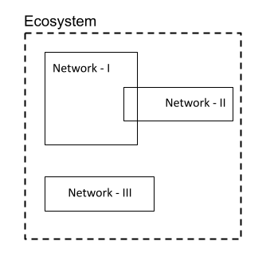

# 3.  Architecture Extendibility
The current specifications described in this document act as the minimal set of APIs which need to be provided by the entities to make the entities interoperable for data sharing. While this may not suffice for many countries and sectors where there might be some additional requirements in setting up the ecosystem or network.

This section talks about the wrappers which could be built at different levels to customize the implementation. These wrappers could help adopt DEPA for countries and sectors.

## 1. Ecosystem level

A DEPA ecosystem is an umbrella for all the networks which exist under it. An ecosystem will usually be governed by a higher authority which may define the policies on the rights of the Data, data custodian rights, data exchange, data storage, interaction with other ecosystems, inter network interaction etc.. . All the ecosystem participants including the gateway will have to adhere to these policies.

In practical sense an ecosystem would be country wide, which may house multiple networks (one for each sector).

The diagram shows an ecosystem with 3 networks where network-I can talk to network-II and vice versa. These two networks can be in different sectors like health and finance, they allow users to share their financial and health information for use cases which span these sectors. Here network-III is a closed loop network which might have a policy to not interact with other open networks.

Apart from just the policies there could be additional API’s at ecosystem level which may be defined to digitally control the networks within it. The specification of these API’s is outside the scope of this document.

Example of an Ecosystem in India context

An ecosystem comprises of all DEPA networks within India. These can be networks like for finance @NPCI, network of insurers by IRDIA, health network by NHA etc… The data protection bill (currently tabled in parliament) when passed could act as an ecosystem wide policy which needs to be followed by all the participants of the ecosystem.

## 2. Network level
    

A DEPA Network is defined by the gateway and the entities who do the on-boarding with gateway as a Data Provider, Data Consumer and Consent Manager. A network can be a purely private network within an enterprise where entities may not be allowed to be a part of the other network at the same time or it can be an open network like in the case of a health or finance sector which are governed by the sector regulators in a country.

The rules of on-boarding the network are governed by the gateway. How the gateway enables this is entirely up to the gateway. A Gateway may choose to provide some additional set of APIs for doing a completely digital on-boarding or it may choose to do it in an online-offline manner where it may provide some portal for the entities to do some monitoring and regular stuff.

## 3. Consent Artifact
    

The consent artifact is the digital document which encapsulates the Data principal consent. The consent artifact can itself evolve over time and can be defined to align with the policies and use cases which exist across countries and sectors.

## 4. Data Request and Response
    
The definition of data request and response rests outside the DEPA specification and can evolve independently. These will differ across countries and sectors.

## 5. Events
    

The DEPA specifications mention only a few events which are required by the entities to emit. But the architecture does not limit itself to define new events at ecosystem or network level. These new events can create a new workflow which can be defined at the Network or ecosystem level .