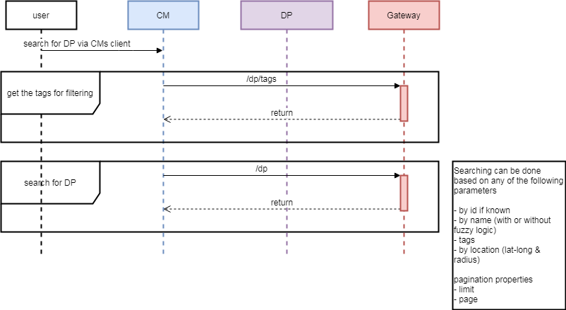
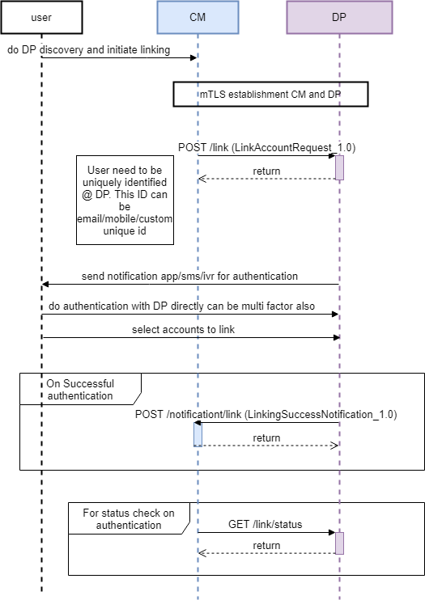
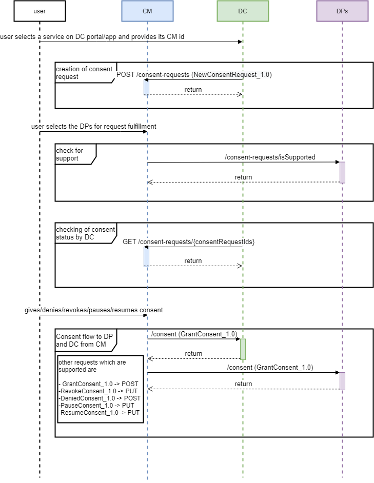
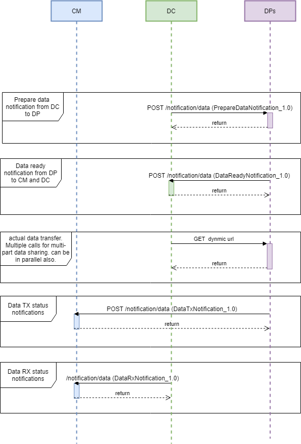

# 4.  APIs and Flows

The APIs defined in this specification are both synchronous and async in nature. As a rule of thumb wherever there is a need to know the status of something in realtime, like getting status of linking or consent we use the synchronous APIs, while the rest of the specification use the asynchronous APIs.
  

Reference to the [OpenAPI](/depa_2.0.yaml) specification.

##  1.  Entity Resolution Flow
    

Entities need to resolve each other in order to establish the mTLS connection between themselves. Gateway will provide the API to resolve the entities and get information about them. For entities to call this API they will need a token issued by the Gateway at the time of onboarding as an authentication mechanism. In addition Gateways can protect their environment by having a mTLS between the entity and themselves or can do IP whitelisting, all this will depend on the gateway security policies.

Resolution process of an entity.

1.  Entities seeking to resolve other entities will need the unique identifier of another party or the domain name (like in the case of CM) which is registered with the Gateway.
    
2.  Using this identifier entity makes the resolution call to the Gateway.
    
3.  Gateway responds with meta information about the entity like address where its API’s are hosted, public key of the entity which is registered and other basic details.

**Endpoint**

***/resolve***

This endpoint resolves the entities. This is either done by the gateway assigned identifiers or the domain name registered with the gateway, like in the case of Consent managers.

Parameters :-
-   ***Id*** - search by id if it's known. This can be different for the same entity on different gateway.
 
After the resolution has been successfully done the entity can initiate the mTLS connection with the other entity. Clients making the resolution query can also cache the results as per the TTL limits defined by the Gateway.

## 2.   Data Provider Discovery Flow
    

For the purpose of linking the DP with the CM we need to discover them first, this is achieved by the discovery flow. This is only required when linking of the accounts is initiated from the CMs system.

All the APIs within this flow are synchronous in nature as only the CM and the gateway are the 2 parties which are interacting with each other.

Sequence Diagram

**Endpoints**

***/dp/tags***

This endpoint lists the tags using which gateway has done the filtering. Example - #Hospital , #Pharmacy , #Bank, etc...

***/dp***

The endpoint which is used to query the gateway. Provides the searching of the DPs based on following criteria

-   ***Id*** - search by id if it's known. This can be different for the same entity on different gateway.
    
-   ***Name*** - search by name of the entity. Can enable/disable fuzzy matching.
    
-   ***Tags*** - search by tags. List of tags on a gateway can be known by the /dp/tags endpoint.
    
-   ***Location*** - search nearby areas. This can be based on radius and current users location.
    

  

Once the DP is discovered its details are known to the CM to initiate the linking process. The meta-data received by the gateway also contains info on how the DP identifies the users in its system. This can be a mobile no, aadhaar no, email-id, custom identifier etc.. This is critical for the CM to know as it needs to capture this information from the user and send notification to DP for initiating linking of the user.

## 3.   Mutual TLS establishment
    

Establishment of Mutual TLS is critical for any of the flows to work in DEPA. Usually this is enabled by adding the certificate of the relying party before the connection is established. Since the participants within a transaction are dynamic in nature hence exchanging the certificates of relying parties is not possible beforehand. To solve this Gateways enable the sharing of registered certificates for establishment of the Mutual TLS by means of resolution flow.
  

A sample flow for establishment of mTLS connection between CM and DP. The same will be applicable for establishing mTLS for CM and DC or DC and DP.

Verification of the certificates

Certificates presented by the Client and the server during the Mutual TLS handshake need to be verified. The certificate presented by each party will have the identifier of the party using which the resolution can happen at the gateway. Post the resolution is successful the public key certificate acquired from the gateway should match with what has been presented during the TLS handshake. If these two certificates are the same then we can say that verification is successful and Mutual TLS can been established.

  
## 4.  Linking flow
    

A precursor to giving a consent is the linking of DP with Users CM account. The linking can be initiated by the user either from the DPs system or CMs system.

### 1.  CM Initiated
    

This will typically be the case when User login to his CMs account and does the discovery of the DP with whom the linking has to be initiated.
  
Sequence diagram

Details of the flow

1.  As a precursor for the flow to begin Mutual TLS connection is established between the CM and DP.
    
2.  CM sends a request to the DP to initiate the linking. If the user exists then move to the next step else respond with error.
    
3.  DP initiates the authentication of the user. This is outside the DEPA flow and will be done in 3 steps.
    

1.  Notification to the user that a request for linking has been received. The notification can take any form like sms, ivr, app notifications etc..
    
2.  Users might have to do the authentication, this can be single factor or multiple depending on the DP.
    
3.  User will approve the request and select the accounts which he wishes to link with the CM. The account selection will only be required if the accounts attribute is not populated by the CM.
    

5.  Once the request is approved a notification from DP to the CM is followed.
    
There is another API provided for checking the status of the linking request in the realtime. This is a sync call.

  

**Endpoints**

***/link***

Endpoint to send the linking request by the CM to the DP. This endpoint is hosted by Gateway and DP.

***/notification/link***

Receive linking notification to the linking request sent earlier. This endpoint is hosted by Gateway and CM.

***/link/status***

Endpoint is hosted by the DP, this is to check in realtime the status of the request sent earlier by the CM.

  

Please refer to the OpenAPI specification for details on the API and the request-response structure.

### 2.   DP Initiated
    

A user also has an option to link his CM account with the DP using DPs system.

It is assumed that the user has logged on to his DPs account before initiating this flow.

Sequence Diagram

Details of the flow:-

1.  User provides his CM id to the DP, this will be in the form of `<user-id>@<CM domain>`.
    
2.  User selects the accounts which he wishes to link if maintaining multiple accounts with DP.
    
3.  Mutual TLS connection established between DP and CM.
    
4.  DP sends out a request to the CM to link the accounts.
    
5.  CM asks for authorization to approve the linking request. The flow for this is not part of the specification, but conceptually this should be done in two steps
    

1.  CM sends notification to the user about the new linking request.
    
2.  Users might have to do authentication and then may or may not authorize the linking.
    

7.  Post approval a success notification is sent to the DP.
   
**Endpoints**

***/link***

Endpoint to send the linking request by the CM to the DP. This endpoint is hosted by Gateway and DP.

***/notification/link***

Receive success linking notification to the linking request sent earlier. This endpoint is hosted by DP.

Please refer to the OpenAPI specification for details on the API and the request-response structure.

Account identifier: The account identifier shared by the DP as part of the linking process with CM can be completely random and hide the original account identifier.

  

## 5.   Consent Flow
    

The consent flow starts with User approaching a DC to take some service, and the DC in order to provide service to the user requests some set of data. That data will be in the DPs system who is holding it in capacity of a data custodian.

Sequence Diagram

Details of the consent flow-

1.  DC requests for data by creating a NewConsentRequest_1.0 and pushes it to the CM of the user , for this user will have to provide his cm-id to the DC. 
    
2.  User selects the DPs and the accounts user holds with DP, which can fulfil the request raised by the DC. If the DP and accounts are still not linked then linking flow has to be followed first do the linking. There can be multiple requests raised by the DC and users can select the same or different DP for each of the consent requests raised.
    
3.  CM can optionally check with the DP that the requested dataType is supported by it or not, this is post the user selects a DP for a consentRequest. This is to make sure we fail fast and give feedback to the user that you need to select a different DP. If this check is not made the failure will happen post consent sharing with DP.
    
4.  DC can in the meantime also check for the status of the consent via a consent status API. This is optional and not required for completion of the consent flow. 
    
5.  Once the DPs and accounts have been selected for each consentRequest CM can take the consent from the user. This may involve doing a 2 factor authentication. A user can choose to take following actions on the consent
    

**Granted** - Users can choose to grant consent for a new consent-request raised by the DC. This involves the creation of the ConsentArtifact which is signed by the CM and/or signed by the User.

**Denied** - Deny the consent request raised.
    
**Revoked** - Revoke if the consent was already given. By default the consent is considered revoked after the expiry time of the consent.
    
**Paused**
    
**Resume**
    

This is a notification from the CM to DC and DP. In case of Denied action there is no call being made to the DP. 
    
Whenever a user gives consent to a consent manager, allowing sharing of data from an DP to an DC, two types of consent artefacts are generated:

1.  An DC-facing artefact: This artefact is an authorization to the DC to be able to fetch information from an DP in the future. This may or may not have any “accounts” info or any information which can identify the DP.
    
2.  An DP-facing artefact: This artefact is essentially a notification to an DP that communicates that “some '' DC is authorized to fetch information from it in the future. The artifact provides the “account” attribute for the DP to identify that data has to be shared from which accounts.
    
Each consent transaction generates one DP-facing artefact and one DC-facing artefact for every pair of DP and DC across which information sharing is consented to.

A special scenario to consider - what if the DC and DP are on different networks and CM is acting as a bridge between these networks and enabling this transaction ? In this case the Consent Artifact generated by the CM can be of a different format for DC and DP. The format of these Consent Artifacts is governed by the Gateway to which the DC or DP is associated with. Since the CM is on both the Gateways it does the job of creating Network compliant Consent Artifact.

**Endpoints**

***/consent-requests***

Endpoint used by the DC to push the consent request to CM.

***/consent-requests/isSupported***

CM can use this API endpoint to check if the requested data type is supported by the DP or not.

***/consent-requests/{consentRequestsIds}***

DC can check for the status of the consent request by using this endpoint. Endpoint is hosted by CM.

***/consent***

The endpoint is hosted by DC and DP to inform about the consent lifecycle actions taken by the user. This endpoint is exposed as

-   POST - for sending out requests like GarantedConsentRequest_1.0 or DeniedConsentRequest_1.0
    
-   PUT - used for requests like RevokeConsentRequest_1.0, PauseConsentRequest_1.0 and ResumeConsentRequest_1.0.
    

  

## 6.   Data Flow
    
Data flow is initiated by the DC to pull the data from the DP. The flow is initiated post the Data Principal has shared the consent artifact with the DC. DC can fetch the data till the consent is valid and meets the conditions defined by the consent artifact.

Sequence Diagram

  
Details of the data flow-

1.  DC sends a notification for DP to prepare data. This request will encapsulate the public key in JWK format which needs to be used by the DP for sharing the encrypted data fetch URL and data access token.
    
2.  DataReadyNotification is triggered by the DP to notify the DC that it can now fetch the data from the shared url. As a part of the notification are the encrypted Data Access Token which will be required by the DC to fetch the data.
    
3.  DC verifies the token and sends out the acknowledgement notification.
    
4.  DC uses the provided endpoint and the access token to fetch the data from DP. Both the parties exchange data over mTLS connection.
    
5.  DC sends out the DataRxNotifications to inform the receiving of the data.
    
6.  DP sends out the DataTxNotifications to inform the sending of the data.

**Endpoints**

***/notification/data***

The endpoint is used by DC and DP to send following notifications

-   PrepareDataNotification - notification triggered by the DC to DP on receiving of consent artifact. This commands the DP to prepare the data which will be fetched.
    
-   DataReadyNotification - DP notifies the DC about the endpoint from which it can fetch the requested data.
    
-   DataTxNotification - Notifications triggered by the DP for giving updates on the data transfer.
    
-   DataRxNotification - Notifications by DC to notify on the data received.
    

***/{dynamic-data-fetch-url}***

Endpoint generated by the DP from where the requested data can be fetched. This is only known to DC and DP.

  

## 7.  Guardian flow
    
Guardian flow details out how the guardianship is established and how Guardians can manage the consent lifecycle of the Data Principal

**Establishment of Guardianship**

1.  User registers itself as the guardian of another user on the DPs system. This is done by legal means or the user will appoint the guardian for himself. The process is specific to each DP and governed by them.
    
2.  As a part of the guardian registration, DP will allocate the user-id to the guardian and maintain a relationship mapping with the Data principal.
    
3.  Guardian using his own cm-id will initiate an account linking process. As a part of the linking process Guardian will be issued a Linking TOKEN and a Guardian TOKEN.
    
4.  Now the guardian can manage the existing consents and give new consents.

**Management of existing consents by the Guardian**

To Manage the existing consents lifecycle guardian’s CM needs to fetch the list of consents from Data Principals CM. To achieve this guardian’s CM will play the role of a DC as well as a CM.

-   Guardian’s CM provider as a DC will raise the request to fetch the existing consents which are to be managed by the Guardian.
    
-   Guardian’s CM provider as CM will collect the Guardian’s consent to fetch the consents. The consent artifact created by the CM here will have the Guardian TOKEN encapsulated for Data Principals CM to verify the relationship. Consent Artifact will also have the CM of Data Principal being mapped as DP to provide the consents.

**Honoring of Consent lifecycle events by the DC**

User cases to honor the consent lifecycle events will fall in two broad categories:-

1.  Guardian’s CM-id registered with DC - In this case the guardian will mention his cm-id and all the consent requests will flow to his consent manager by default. Here DC can easily honor the consent life cycle events generated by the Guardian’s CM.
    
2.  Data Principals CM-id registered with CM - Here DC will need the proof that the guardian is indeed the guardian of the Data Principal to honor the events. Here the events will be accompanied by the Guardian TOKEN issued by the DP as the proof of being guardian.
    

  

## 8.   Nominee flow
    
A nominee is the person who acts as the account controller post the death of the Data Principal. A nominee can be appointed by the Data Principal during his lifetime or nominee can approach the DP with adequate proof to be listed as nominee of the account.

The Nominee flow will be exactly the same as the guardian flow. One major difference is that instead of issuing the Guardian TOKEN the DP issues a Nominee TOKEN as a proof of being a nominee.

  

## 9.   Delegatee flow
    

TODO