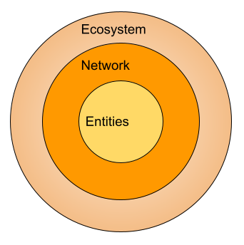
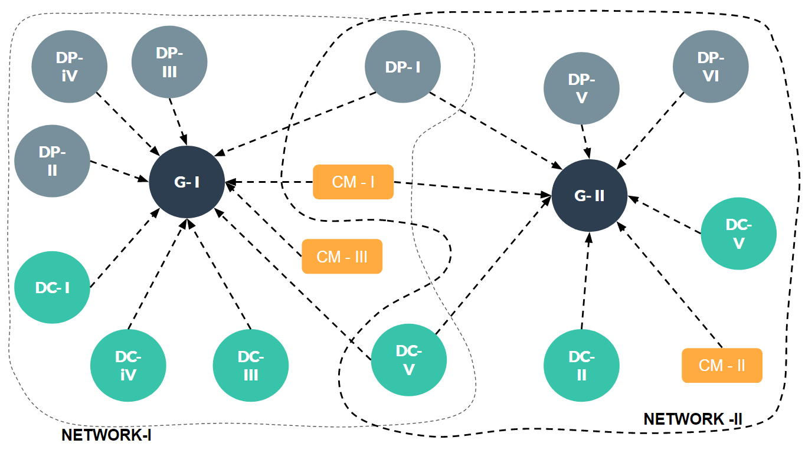

# Ecosystem and Network

An ecosystem refers to the collection of multiple DEPA enabled networks. These networks are pivoted around their respective registries and contain Data Providers, Data Consumers and Consent Managers. These entities come together to enable the consented flow of data across multiple systems in an interoperable manner.

Ecosystem policies are applicable to all the networks within it and policies of a network are applicable to the entities joining that network.

To visualize this we can assume an ecosystem to be country wide, where ecosystem policies are governed by the laws within that country. Similarly networks can be sectoral, where network policies are governed by the regulators of that sector within a country.

## Overlapping Networks

DEPA architecture supports entities to join multiple networks, but this itself will be governed by the ecosystem and the network policies. Assuming the policies allow, this will result in overlapping networks like shown in the diagram below.

The two networks showcased here are governed by the policies of the ecosystem along with Registry-I and Registry-II policies respectively. Each network has some data providers, data consumers and consent managers participating. There are entities which participate in multiple networks, these entities will have to follow the policies of Network-I as well as Network-II.

These overlapping networks are important for the ecosystem as they will allow for sharing of data for the use cases which span networks (or sectors).

Example of cross sectoral use case

Health Insurer ( governed by the insurance sector regulator) might need your past health records (from the health sector) and the last 6 months bank statement (from the finance sector). All this for assisting users to select a better health insurance plan. For this use case consent manager being part of the all (insurance, health and finance) the sectoral networks can enable the data exchange for the user.
